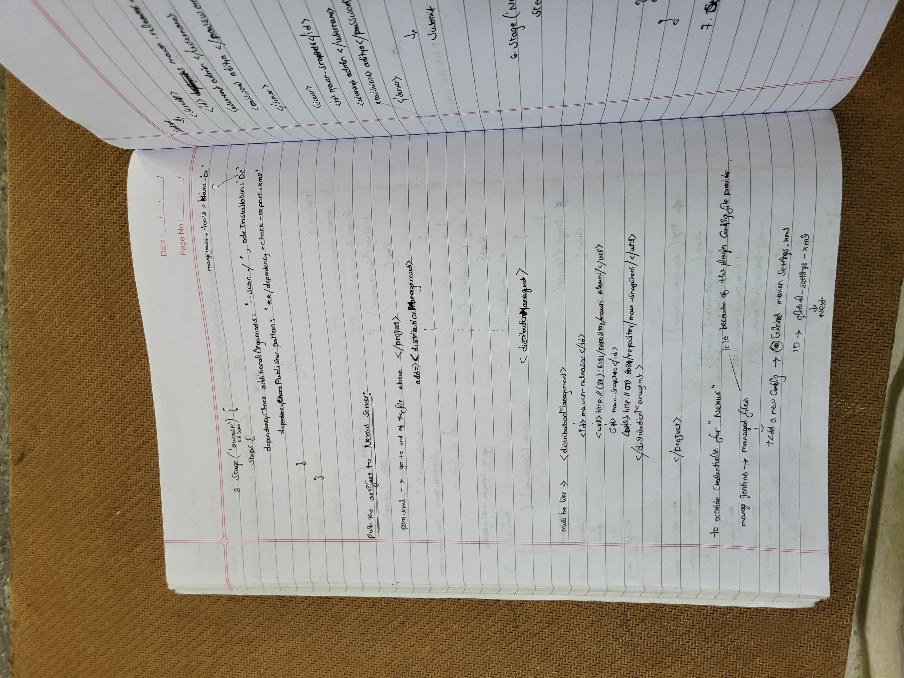
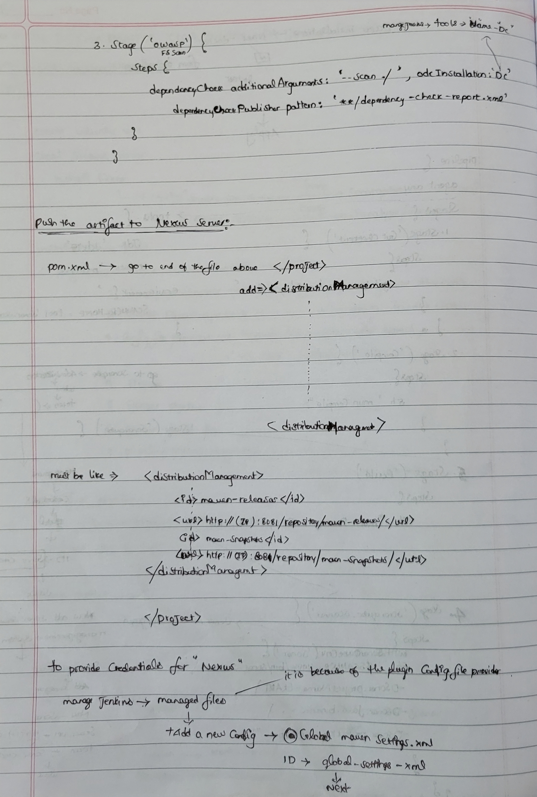
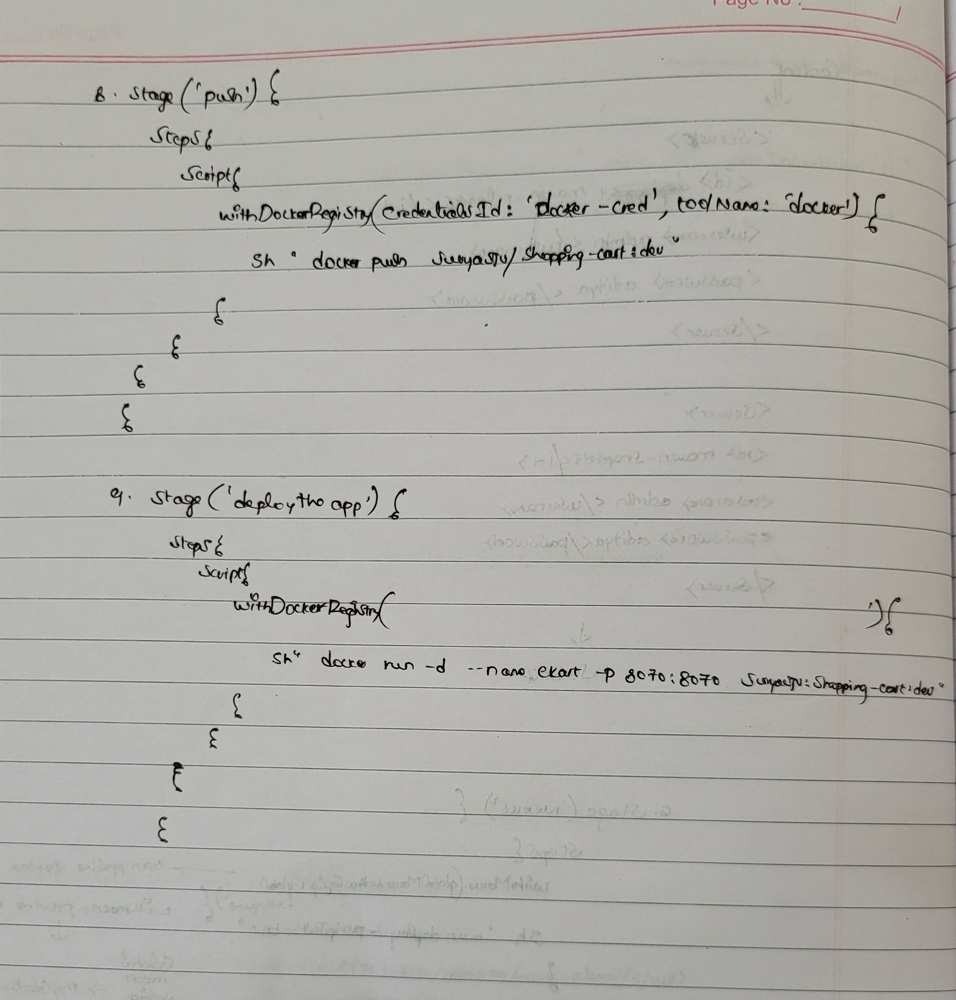

# Spring Boot Shopping Cart Web App

## About

This is a demo project for practicing Spring + Thymeleaf. The idea was to build some basic shopping cart web app.

It was made using **Spring Boot**, **Spring Security**, **Thymeleaf**, **Spring Data JPA**, **Spring Data REST and Docker**. 
Database is in memory **H2**.

There is a login and registration functionality included.

Users can shop for products. Each user has his own shopping cart (session functionality).
Checkout is transactional.

## Configuration

### Configuration Files

Folder **src/resources/** contains config files for **shopping-cart** Spring Boot application.

* **src/resources/application.properties** - main configuration file. Here it is possible to change admin username/password,
as well as change the port number.

## How to run

There are several ways to run the application. You can run it from the command line with included Maven Wrapper, Maven or Docker. 

Once the app starts, go to the web browser and visit `http://localhost:8070/home`

Admin username: **admin**

Admin password: **admin**

User username: **user**

User password: **password**

### Maven Wrapper

#### Using the Maven Plugin

Go to the root folder of the application and type:
```bash
$ chmod +x scripts/mvnw
$ scripts/mvnw spring-boot:run
```

#### Using Executable Jar

Or you can build the JAR file with 
```bash
$ scripts/mvnw clean package
``` 

Then you can run the JAR file:
```bash
$ java -jar target/shopping-cart-0.0.1-SNAPSHOT.jar
```

### Maven

Open a terminal and run the following commands to ensure that you have valid versions of Java and Maven installed:

```bash
$ java -version
java version "1.8.0_102"
Java(TM) SE Runtime Environment (build 1.8.0_102-b14)
Java HotSpot(TM) 64-Bit Server VM (build 25.102-b14, mixed mode)
```

```bash
$ mvn -v
Apache Maven 3.3.9 (bb52d8502b132ec0a5a3f4c09453c07478323dc5; 2015-11-10T16:41:47+00:00)
Maven home: /usr/local/Cellar/maven/3.3.9/libexec
Java version: 1.8.0_102, vendor: Oracle Corporation
```

#### Using the Maven Plugin

The Spring Boot Maven plugin includes a run goal that can be used to quickly compile and run your application. 
Applications run in an exploded form, as they do in your IDE. 
The following example shows a typical Maven command to run a Spring Boot application:
 
```bash
$ mvn spring-boot:run
``` 

#### Using Executable Jar

To create an executable jar run:

```bash
$ mvn clean package
``` 

To run that application, use the java -jar command, as follows:

```bash
$ java -jar target/shopping-cart-0.0.1-SNAPSHOT.jar
```

To exit the application, press **ctrl-c**.

### Docker

It is possible to run **shopping-cart** using Docker:

Build Docker image:
```bash
$ mvn clean package
$ docker build -t shopping-cart:dev -f docker/Dockerfile .
```

Run Docker container:
```bash
$ docker run --rm -i -p 8070:8070 \
      --name shopping-cart \
      shopping-cart:dev
```

##### Helper script

It is possible to run all of the above with helper script:

```bash
$ chmod +x scripts/run_docker.sh
$ scripts/run_docker.sh
```

## Docker 

Folder **docker** contains:

* **docker/shopping-cart/Dockerfile** - Docker build file for executing shopping-cart Docker image. 
Instructions to build artifacts, copy build artifacts to docker image and then run app on proper port with proper configuration file.

## Util Scripts

* **scripts/run_docker.sh.sh** - util script for running shopping-cart Docker container using **docker/Dockerfile**

## Tests

Tests can be run by executing following command from the root of the project:

```bash
$ mvn test
```

## Helper Tools

### HAL REST Browser

Go to the web browser and visit `http://localhost:8070/`

You will need to be authenticated to be able to see this page.

### H2 Database web interface

Go to the web browser and visit `http://localhost:8070/h2-console`

In field **JDBC URL** put 
```
jdbc:h2:mem:shopping_cart_db
```

In `/src/main/resources/application.properties` file it is possible to change both
web interface url path, as well as the datasource url.


# 🚀 Ekart Java Application - CI/CD Pipeline with Jenkins

This project showcases a complete CI/CD pipeline for the **Ekart Java backend application** using **Jenkins**, integrating **Maven**, **SonarQube**, **OWASP Dependency Check**, **Nexus**, **Docker**, and **Docker Hub**.


PORTS to open:


---

## 📦 Tech Stack

- **Java 17**
- **Apache Maven**
- **Jenkins Pipeline**
- **SonarQube (Code Quality)**
- **OWASP Dependency Check (Security Scanning)**
- **Nexus Repository (Artifact Storage)**
- **Docker & Docker Hub (Containerization & Image Registry)**

---

## ⚙️ Pipeline Workflow (Jenkinsfile)

The pipeline automates the following stages:

🧾 Checkout:
- Pulls code from the GitHub repository:  
  `https://github.com/SuryaSJV/Ekart.git`

⚒️ Compile:

`mvn clean install -DskipTests`


 🔐 OWASP Dependency Check
Scans for known vulnerabilities in dependencies and generates a security report.


🧹 SonarQube Analysis
Analyzes code quality, code smells, bugs, and vulnerabilities using SonarQube.


📦 Build

`mvn package`

📤 Publish to Nexus:
Deploys the .jar artifact to a private Nexus repository.


🐳 Build Docker Image:
```
docker build -t ekart -f docker/Dockerfile .
docker tag ekart suryasjv/ekart:latest
```


☁️ Push Docker Image to Docker Hub:
```
docker login -u $DOCKER_USERNAME -p $DOCKER_PASSWORD
docker push suryasjv/ekart:latest
```


🚀 Deploy:

```docker run -d --name ekart -p 8070:8070 suryasjv/ekart:latest```


✅ Jenkins Integrations
```
Tool	               Purpose

Maven	         Build, test, and package the Java app
SonarQube	     Code quality and static analysis
OWASP DC	     Dependency vulnerability scanning
Nexus	         Internal Maven artifact repository
Docker           Image building and containerization
Docker Hub	     Remote image storage and sharing
GitHub	         Version control
```

🔐 Credential Management
Credentials (DockerHub, Nexus, SonarQube) are stored securely in Jenkins.


Global tool configurations set for Maven, JDK, Sonar Scanner, etc.


📁 Project Structure
```
Ekart/
├── src/                       
├── pom.xml                   
├── docker/
│   └── Dockerfile            
└── Jenkinsfile         
```

📊 Reports & Artifacts:

OWASP Report: dependency-check-report.xml

Code Coverage: Jacoco

Sonar Dashboard: View quality gates and code smells

Docker Image: suryasjv/ekart

Nexus Artifact: JAR uploaded to maven-snapshots

🙌 Achievements
✅ End-to-End CI/CD automation with Jenkins

✅ Integrated code quality and security gates

✅ Docker image builds and pushed to DockerHub

✅ Deployment via container on port 8070

✅ Reusable, scalable DevOps pipeline


🏁 Final Output
Application runs in a Docker container:

`http://<server-ip>:8070/`


Docker Image:


`suryasjv/ekart:latest`

Jenkins Deployment:
```
Container Name: ekart

Exposed Port: 8070
```

follow as below
1.
2.
3.
4.
5.
6.